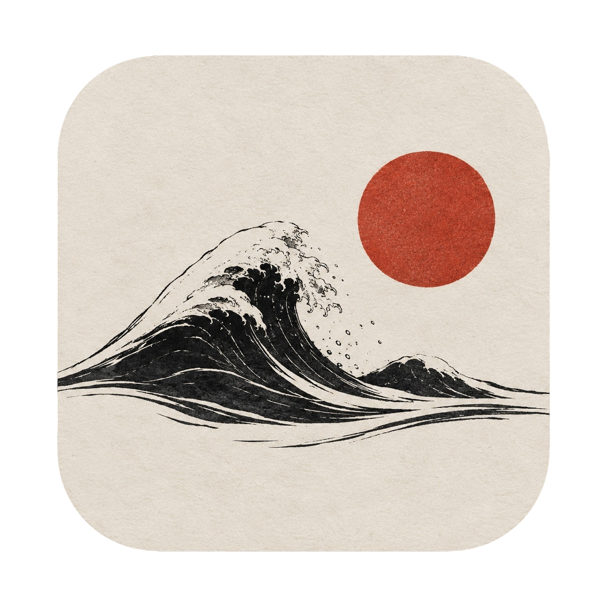
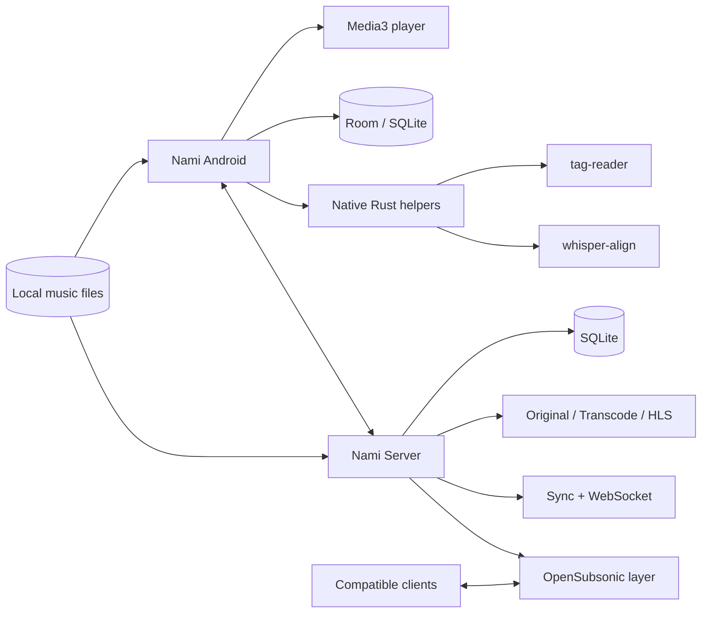
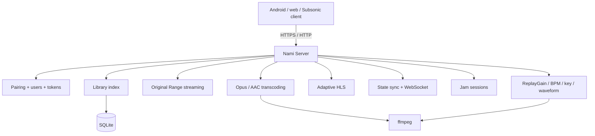

<p align="right">
  <strong>English</strong> · <a href="README.ru.md">Русский</a>
</p>

<p align="center">
  
</p>

<h1 align="center">Nami</h1>

<p align="center">
  <strong>your music, your day.</strong>
</p>

<p align="center">
  Local-first music player for Android with an optional self-hosted Rust server.<br/>
  Built around ownership, a transparent audio path, rich lyrics and a library that stays yours.
</p>

<p align="center">
  
  
  
  
  
  
</p>

<p align="center">
  <a href="#quick-start"></a>
  <a href="server/README.md"></a>
  <a href="#architecture"></a>
  <a href="https://github.com/MozzarellaCheesee/Nami/issues"></a>
</p>

---

> [!IMPORTANT]
> **Nami is under active development.** The current Android and server codebases identify themselves as `0.1.0`, and APIs, storage formats and UI may still change. This README separates what is already represented in the repository from the longer-term product direction.

## What is Nami?

**Nami (波 — “wave”)** is a personal music ecosystem for people who keep their own collection and want the player to serve the library — not the other way around.

The Android app is designed as an **offline-first player without a mandatory account or cloud dependency**. The optional **Nami Server** turns the same collection into a private streaming service with device pairing, original-quality streaming, transcoding, sync, Jam sessions and an OpenSubsonic-compatible layer.

<table>
<tr>
<td width="50%" valign="top">

### 🎧 Android player

- Native Android app built with Kotlin + Jetpack Compose.
- Media3-based playback architecture.
- Modular library, player, search, playlists and trash features.
- Room/SQLite data layer and FTS-backed search architecture.
- Native Rust helpers for tag reading and Whisper alignment.
- Lyrics, waveform and audio-analysis workstreams.
- Baseline Profile module for startup/runtime performance work.

</td>
<td width="50%" valign="top">

### 🦀 Nami Server

- Rust + Axum + SQLite.
- Original byte-for-byte streaming with HTTP Range support.
- Opus/AAC transcoding and optional HLS.
- QR/device pairing and token-based access.
- Multi-user libraries, guest links and Jam sessions.
- Delta-style state synchronization over HTTP + WebSocket.
- Lyrics, library health, audio analysis and ListenBrainz scrobbling.
- OpenSubsonic-compatible playback subset.

</td>
</tr>
</table>

## Why Nami?

| Principle | What it means |
|---|---|
| **Local first** | Your library works without a server, cloud account or permanent internet connection. |
| **Own your music** | Nami is built around files you control instead of a catalog you rent. |
| **Audio path over marketing** | The project treats sample rate, output path, ReplayGain, DSP and device capabilities as explicit technical state. |
| **Lyrics are first-class data** | Synced lyrics, translation and language-learning workflows are part of the product design, not an afterthought. |
| **Self-hosting is optional** | The server extends the local player; it is not required to use the app. |
| **Network features are explicit** | External services are intended to be opt-in and visible to the user. |

## Project status

The repository already contains a substantial Android application architecture and a functional Rust server. Workstreams are intentionally uneven: some server capabilities are further along than parts of the advanced Android audio roadmap.

| Area | Repository today | Direction |
|---|---|---|
| Android shell & architecture | ✅ Present | Continue vertical feature integration |
| Library / player / search / playlists / trash modules | ✅ Present | Expand UX, metadata tooling and customization |
| Native tag reader | ✅ Present | Broaden format/metadata coverage |
| Whisper alignment path | ✅ Present | Deepen lyrics synchronization workflows |
| Nami Server | ✅ Functional server code | Harden UX, packaging and compatibility |
| Server sync / Jam / sharing | ✅ Present | Client integration and resilience |
| OpenSubsonic | 🟡 Playback-focused subset | Expand only where useful and maintainable |
| Web client | 🟡 Minimal | Richer library/player/admin UI |
| Advanced USB bit-perfect / custom UAC2 / native DSD | 🧭 Roadmap | Late-stage audio work after the core player is stable |

> [!NOTE]
> A feature appearing in the product roadmap does not automatically mean it is finished on every device or exposed in the current UI.

## Highlights

### 🎼 A library that behaves like a library

Nami's product plan goes beyond “scan a folder and show a list”. The target library model includes albums, artists, genres, folders, tags, ratings, smart playlists, play history, moments, A–B loops, metadata health, duplicate detection and full-text search — while keeping local files usable without the server.

### 🎛️ A transparent audio path

The audio direction is built around a simple rule: **do not hide what happens to the signal**. The project design includes native-rate playback where the device allows it, ReplayGain/R128, parametric EQ, output-device profiles, crossfeed, resampling, dithering and an “audio path” view that explains what is actually happening between the file and the output device.

Advanced USB-exclusive output, DoP and a custom UAC2 path are intentionally late-stage work because Android audio behavior depends heavily on the device HAL and connected DAC.

### 📝 Lyrics as a learning surface

A major part of the Nami identity is lyrics that can carry more than one representation of a line: original text, reading/romaji and translation. The wider plan also includes word-level interaction, Japanese reading support, a personal vocabulary and export-oriented study workflows.

### 🌐 Your server, not somebody else's cloud

Nami Server is optional and self-hosted. It is designed for home servers, small VPS instances, NAS devices and low-power machines. The current server implementation includes streaming, user/device authentication, sharing, synchronization, Jam sessions, metadata enrichment, audio analysis and a lightweight web interface.

For complete server behavior, configuration, API groups, external access and known limitations, see **[server/README.md](server/README.md)**.

## Privacy model

The product direction is deliberately conservative about network access:

- no mandatory Nami account for local playback;
- no requirement to upload the local library to a third-party cloud;
- external metadata/lyrics/scrobbling services are separate features;
- the self-hosted server can stay LAN-only;
- remote access can be placed behind Tailscale, Cloudflare Tunnel or your own HTTPS reverse proxy;
- server-side passwords are hashed with Argon2id; device/session access uses tokens.

> [!TIP]
> For the smallest attack surface, keep Nami Server inside your home network or expose it through a private overlay network such as Tailscale instead of forwarding the application port directly to the internet.

<a id="architecture"></a>
## Architecture



### Android modules

The current Gradle settings include:

```text
app
├── core:model
├── core:database
├── core:designsystem
├── core:native
├── core:tracker
├── core:whisper
├── domain
├── data
├── player
├── feature:library
├── feature:player
├── feature:search
├── feature:playlists
├── feature:trash
└── baselineprofile
```

### Repository map

```text
Nami/
├── app/                         Android application entry point
├── assets/                      Project icons and visual assets
├── baselineprofile/             Android Baseline Profile generation
├── core/
│   ├── database/                Room / persistence
│   ├── designsystem/            Compose design system
│   ├── model/                   Shared models
│   ├── native/                  Android ↔ native integration
│   ├── tracker/                 Tracking / statistics infrastructure
│   └── whisper/                 Whisper-related integration
├── data/                        Repository implementations / data layer
├── domain/                      Domain contracts and use cases
├── feature/
│   ├── library/
│   ├── player/
│   ├── playlists/
│   ├── search/
│   └── trash/
├── native/
│   ├── tag-reader/              Rust tag-reading workspace member
│   └── whisper-align/           Rust Whisper alignment workspace member
├── player/                      Android playback module
├── server/                      Self-hosted Rust server
├── docs/superpowers/plans/      Implementation/design work notes
├── build.gradle.kts
└── settings.gradle.kts
```

<a id="quick-start"></a>
## Quick start

### Android

**Requirements**

- JDK 21
- Android SDK with API 35
- Android device/emulator running Android 8.0 (API 26) or newer

```bash
git clone https://github.com/MozzarellaCheesee/Nami.git
cd Nami

# Build a debug APK
./gradlew :app:assembleDebug
```

The APK is produced under:

```text
app/build/outputs/apk/debug/
```

Install directly on a connected device:

```bash
./gradlew :app:installDebug
```

Run JVM/unit tests:

```bash
./gradlew test
```

> [!NOTE]
> Release signing is intentionally separate from the normal development build and uses local signing properties that are not committed to the repository.

### Nami Server — native

**Requirements**

- Rust toolchain / Cargo
- `ffmpeg` for transcoding and server-side audio analysis
- `fpcalc` (Chromaprint) only if fingerprints are needed

```bash
git clone https://github.com/MozzarellaCheesee/Nami.git
cd Nami/server
cargo run --release
```

On first launch without `config.toml`, the server starts its setup flow at:

```text
http://<server-address>:4533/setup
```

### Nami Server — Docker

```bash
cd server

docker build -t nami-server .

docker run -d \
  --name nami-server \
  --restart unless-stopped \
  -p 4533:4533 \
  -v /path/to/music:/music:ro \
  -v nami-data:/data \
  nami-server
```

For domain + automatic Let's Encrypt TLS, the repository also contains `server/docker-compose.yml` and a `Caddyfile`. See the **[server documentation](server/README.md#remote-access)** before exposing the service outside your LAN.

## Server at a glance



The server is intentionally designed around a small dependency footprint and a target class of roughly **1 CPU core / 512 MB RAM / tens of thousands of tracks**. Actual memory and CPU use naturally depend on collection size, active streams, transcoding and analysis work.

## Roadmap

The project plan is organized as progressive workstreams rather than one giant “finish everything” milestone:

1. **Playing skeleton** — playback service, session, import, database, basic library and Now Playing.
2. **Library** — metadata scanner, albums/artists, search, queue, playlists, trash/undo.
3. **Lyrics** — synced LRC, enhanced timing, editor and multilayer lyrics.
4. **Audio path A** — float pipeline, EQ, ReplayGain, crossfade, dithering and output profiles.
5. **Language features** — Japanese morphology, furigana, dictionary and study workflows.
6. **Nami character** — waveform, Moments, A–B loops, Wi-Fi Drop, stats, library health, themes and deeper customization.
7. **Adaptive layouts** — landscape, tablets, foldables and large-screen navigation.
8. **Server core** — Rust server, auth, original streaming, transcoding, Docker and pairing.
9. **Server integration** — analysis, sync, offline-aware client behavior, web UI and OpenSubsonic compatibility.
10. **Advanced audio B/C** — platform bit-perfect paths, DoP, custom UAC2 and native DSD work.

Several of these workstreams already overlap in the repository; the list is a product-development order, not a claim that only earlier numbers exist today.

## Design language

Nami's base visual language is built around an ink/paper/cinnabar palette:

| Role | Value | Name |
|---|---:|---|
| Background | `#0C0D0F` | Ink |
| Primary text | `#EDEAE4` | Paper |
| Accent | `#C24A34` | Cinnabar |
| Secondary | `#9B9A97` | Neutral |

The repository already contains several wave/kanji icon variants under [`assets/`](assets/).

## Contributing

Nami is still evolving quickly, so focused changes are easier to review than broad rewrites.

1. Search existing [issues](https://github.com/MozzarellaCheesee/Nami/issues) before starting a large change.
2. Keep changes scoped to one vertical feature when possible.
3. Add or update tests for behavior that can regress.
4. Preserve local-first behavior and avoid introducing mandatory network dependencies.
5. Document intentional deviations from the architecture instead of letting code and design drift silently.

For large architectural changes, open an issue first and describe the user problem, the proposed boundary and what the change would make harder as well as easier.

## A few deliberate non-goals

Nami is not trying to become:

- another subscription streaming catalog;
- an app that silently sends a personal library to a hosted backend;
- a marketing wrapper around “Hi-Res” badges without exposing the real output path;
- a server that requires heavyweight infrastructure just to play files at home.

## Support the project

If Nami is useful to you, the simplest ways to help are to **star the repository**, report reproducible issues and test on hardware the project does not yet cover — especially unusual Android audio devices, external DACs, large libraries and low-power servers.

<p align="center">
  <a href="https://github.com/MozzarellaCheesee/Nami/stargazers"></a>
</p>

---

<p align="center">
  <strong>Nami — your music, locally.</strong><br/>
  Built for clean sound, owned libraries and digital independence. 🌊
</p>

<!--
Project plan currently specifies dual licensing under Apache-2.0 / MIT.
Before presenting a license badge in the public README, add the actual license files to the repository.
-->
