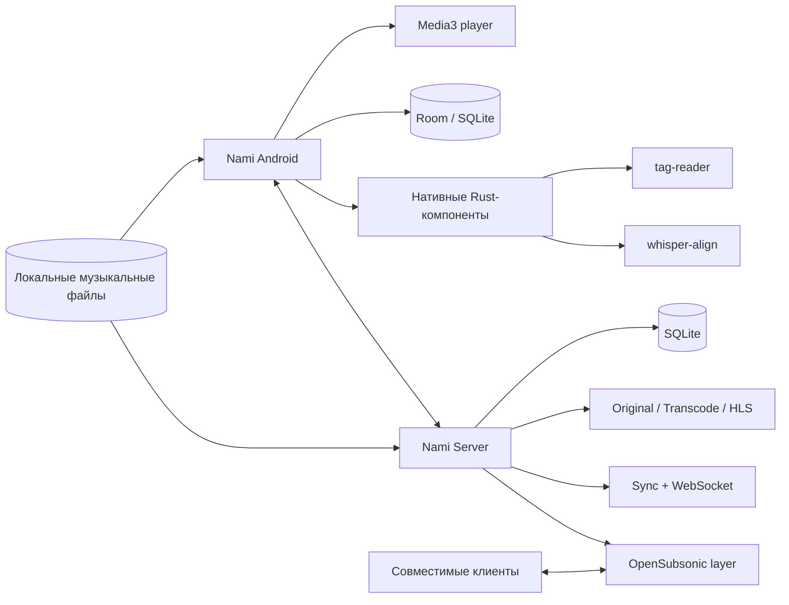
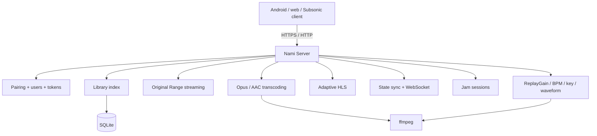

<p align="right">
  <a href="README.md">English</a> · <strong>Русский</strong>
</p>

<p align="center">
  
</p>

<h1 align="center">Nami</h1>

<p align="center">
  <strong>your music, your day.</strong>
</p>

<p align="center">
  Local-first музыкальный плеер для Android с опциональным self-hosted сервером на Rust.<br/>
  Создан вокруг владения своей музыкой, прозрачного аудиотракта, богатой работы с лирикой и библиотеки, которая остаётся вашей.
</p>

<p align="center">
  
  
  
  
  
  
</p>

<p align="center">
  <a href="#quick-start"></a>
  <a href="server/README.ru.md"></a>
  <a href="#architecture"></a>
  <a href="https://github.com/MozzarellaCheesee/Nami/issues"></a>
</p>

---

> [!IMPORTANT]
> **Nami находится в активной разработке.** Текущие Android- и server-кодовые базы имеют версию `0.1.0`; API, форматы хранения и интерфейс ещё могут меняться. Этот README отделяет то, что уже представлено в репозитории, от долгосрочного направления продукта.

## Что такое Nami?

**Nami (波 — «волна»)** — персональная музыкальная экосистема для людей, которые хранят собственную коллекцию и хотят, чтобы плеер служил библиотеке, а не наоборот.

Android-приложение проектируется как **offline-first плеер без обязательного аккаунта и зависимости от облака**. Опциональный **Nami Server** превращает ту же коллекцию в приватный стриминговый сервис с сопряжением устройств, передачей оригинального качества, транскодингом, синхронизацией, Jam-сессиями и слоем совместимости с OpenSubsonic.

<table>
<tr>
<td width="50%" valign="top">

### 🎧 Android-плеер

- Нативное Android-приложение на Kotlin + Jetpack Compose.
- Архитектура воспроизведения на базе Media3.
- Модульные библиотека, плеер, поиск, плейлисты и корзина.
- Слой данных Room/SQLite и архитектура поиска на FTS.
- Нативные Rust-компоненты для чтения тегов и Whisper-выравнивания.
- Направления разработки лирики, waveform и анализа аудио.
- Модуль Baseline Profile для оптимизации запуска и производительности.

</td>
<td width="50%" valign="top">

### 🦀 Nami Server

- Rust + Axum + SQLite.
- Побайтовая отдача оригинала с поддержкой HTTP Range.
- Транскодинг Opus/AAC и опциональный HLS.
- Сопряжение по QR-коду и токенизированный доступ.
- Многопользовательские библиотеки, гостевые ссылки и Jam-сессии.
- Дельта-синхронизация состояния через HTTP + WebSocket.
- Лирика, здоровье библиотеки, анализ аудио и скробблинг ListenBrainz.
- Ориентированный на воспроизведение поднабор OpenSubsonic.

</td>
</tr>
</table>

## Почему Nami?

| Принцип | Что это означает |
|---|---|
| **Local-first** | Ваша библиотека работает без сервера, облачного аккаунта или постоянного подключения к интернету. |
| **Владейте своей музыкой** | Nami строится вокруг файлов, которыми управляете вы, а не каталога, который вы арендуете. |
| **Аудиотракт важнее маркетинга** | Частота дискретизации, путь вывода, ReplayGain, DSP и возможности устройства рассматриваются как явное техническое состояние. |
| **Лирика — данные первого класса** | Синхронизированный текст, перевод и сценарии изучения языка входят в основу продукта, а не добавляются постфактум. |
| **Self-hosting опционален** | Сервер расширяет локальный плеер, но не требуется для использования приложения. |
| **Сетевые функции прозрачны** | Внешние сервисы должны включаться явно и быть видимыми пользователю. |

## Состояние проекта

В репозитории уже находится существенная архитектура Android-приложения и функциональный сервер на Rust. Направления разработки намеренно находятся на разных стадиях: некоторые серверные возможности продвинулись дальше, чем отдельные части расширенного Android-аудиотракта.

| Область | Репозиторий сегодня | Направление |
|---|---|---|
| Каркас и архитектура Android | ✅ Есть | Продолжать вертикальную интеграцию функций |
| Модули библиотеки / плеера / поиска / плейлистов / корзины | ✅ Есть | Расширять UX, метаданные и кастомизацию |
| Нативное чтение тегов | ✅ Есть | Расширять поддержку форматов и метаданных |
| Whisper-выравнивание | ✅ Есть | Углублять сценарии синхронизации лирики |
| Nami Server | ✅ Функциональный код сервера | Усиливать UX, упаковку и совместимость |
| Server sync / Jam / sharing | ✅ Есть | Интеграция клиента и отказоустойчивость |
| OpenSubsonic | 🟡 Поднабор для воспроизведения | Расширять там, где это полезно и поддерживаемо |
| Веб-клиент | 🟡 Минимальный | Более богатый UI библиотеки/плеера/администрирования |
| Продвинутый USB bit-perfect / собственный UAC2 / native DSD | 🧭 Roadmap | Поздний этап после стабилизации основного плеера |

> [!NOTE]
> Наличие функции в продуктовом roadmap не означает автоматически, что она завершена на каждом устройстве или уже доступна в текущем UI.

## Главное

### 🎼 Библиотека, которая ведёт себя как библиотека

План Nami идёт дальше идеи «просканировать папку и показать список». Целевая модель библиотеки включает альбомы, артистов, жанры, папки, теги, рейтинги, умные плейлисты, историю воспроизведения, Moments, A–B петли, здоровье метаданных, поиск дубликатов и полнотекстовый поиск — при этом локальные файлы остаются доступными без сервера.

### 🎛️ Прозрачный аудиотракт

Аудионаправление строится вокруг простого правила: **не скрывать, что происходит с сигналом**. В дизайн проекта входят воспроизведение с родной частотой там, где это позволяет устройство, ReplayGain/R128, параметрический EQ, профили устройств вывода, crossfeed, ресемплинг, dithering и экран «аудиотракт», объясняющий, что фактически происходит между файлом и выходным устройством.

Эксклюзивный USB-вывод, DoP и собственный UAC2-путь намеренно оставлены на поздний этап, поскольку поведение Android-аудио сильно зависит от HAL устройства и подключённого ЦАП.

### 📝 Лирика как поверхность для изучения языка

Важная часть идентичности Nami — строки лирики, способные хранить несколько представлений: оригинал, чтение/romaji и перевод. Расширенный план также включает взаимодействие на уровне слов, поддержку японских чтений, личный словарь и сценарии обучения с экспортом.

### 🌐 Ваш сервер, а не чужое облако

Nami Server опционален и разворачивается самостоятельно. Он проектируется для домашних серверов, небольших VPS, NAS и маломощных устройств. Текущая серверная реализация включает стриминг, аутентификацию пользователей/устройств, sharing, синхронизацию, Jam-сессии, обогащение метаданных, анализ аудио и лёгкий веб-интерфейс.

Полное описание поведения сервера, конфигурации, API-групп, внешнего доступа и известных ограничений находится в **[server/README.ru.md](server/README.ru.md)**.

## Модель приватности

Направление продукта намеренно консервативно относится к сетевому доступу:

- для локального воспроизведения не требуется обязательный аккаунт Nami;
- локальную библиотеку не нужно загружать в стороннее облако;
- внешние сервисы метаданных/лирики/скробблинга являются отдельными функциями;
- self-hosted сервер может оставаться доступным только в LAN;
- внешний доступ можно разместить за Tailscale, Cloudflare Tunnel или собственным HTTPS reverse proxy;
- серверные пароли хешируются Argon2id, а доступ устройств/сессий использует токены.

> [!TIP]
> Для минимальной поверхности атаки оставляйте Nami Server внутри домашней сети или публикуйте его через приватную overlay-сеть вроде Tailscale вместо прямого проброса порта приложения в интернет.

<a id="architecture"></a>

## Архитектура



### Android-модули

Текущие Gradle settings включают:

```text
app
├── core:model
├── core:database
├── core:designsystem
├── core:native
├── core:tracker
├── core:whisper
├── domain
├── data
├── player
├── feature:library
├── feature:player
├── feature:search
├── feature:playlists
├── feature:trash
└── baselineprofile
```

### Карта репозитория

```text
Nami/
├── app/                         Точка входа Android-приложения
├── assets/                      Иконки и визуальные ассеты проекта
├── baselineprofile/             Генерация Android Baseline Profile
├── core/
│   ├── database/                Room / хранение данных
│   ├── designsystem/            Design system Compose
│   ├── model/                   Общие модели
│   ├── native/                  Интеграция Android ↔ native
│   ├── tracker/                 Инфраструктура трекинга / статистики
│   └── whisper/                 Интеграция Whisper
├── data/                        Реализации репозиториев / data layer
├── domain/                      Доменные контракты и use case
├── feature/
│   ├── library/
│   ├── player/
│   ├── playlists/
│   ├── search/
│   └── trash/
├── native/
│   ├── tag-reader/              Rust workspace-компонент чтения тегов
│   └── whisper-align/           Rust workspace-компонент Whisper alignment
├── player/                      Android-модуль воспроизведения
├── server/                      Self-hosted Rust-сервер
├── docs/superpowers/plans/      Заметки по реализации/дизайну
├── build.gradle.kts
└── settings.gradle.kts
```

<a id="quick-start"></a>

## Быстрый старт

### Android

**Требования**

- JDK 21
- Android SDK с API 35
- Android-устройство/эмулятор на Android 8.0 (API 26) или новее

```bash
git clone https://github.com/MozzarellaCheesee/Nami.git
cd Nami

# Собрать debug APK
./gradlew :app:assembleDebug
```

APK будет создан в:

```text
app/build/outputs/apk/debug/
```

Установить напрямую на подключённое устройство:

```bash
./gradlew :app:installDebug
```

Запустить JVM/unit-тесты:

```bash
./gradlew test
```

> [!NOTE]
> Подписание release-сборки намеренно отделено от обычной development-сборки и использует локальные signing properties, которые не коммитятся в репозиторий.

### Nami Server — нативный запуск

**Требования**

- Rust toolchain / Cargo
- `ffmpeg` для транскодинга и серверного анализа аудио
- `fpcalc` (Chromaprint) только если нужны fingerprint'ы

```bash
git clone https://github.com/MozzarellaCheesee/Nami.git
cd Nami/server
cargo run --release
```

При первом запуске без `config.toml` сервер поднимает мастер настройки по адресу:

```text
http://<server-address>:4533/setup
```

### Nami Server — Docker

```bash
cd server

docker build -t nami-server .

docker run -d \
  --name nami-server \
  --restart unless-stopped \
  -p 4533:4533 \
  -v /path/to/music:/music:ro \
  -v nami-data:/data \
  nami-server
```

Для домена + автоматического Let's Encrypt TLS в репозитории также есть `server/docker-compose.yml` и `Caddyfile`. Перед публикацией сервиса за пределами LAN прочитайте раздел **[серверной документации](server/README.ru.md#remote-access)**.

## Сервер в двух словах



Сервер намеренно проектируется с небольшим набором зависимостей и целевым классом примерно **1 CPU core / 512 MB RAM / десятки тысяч треков**. Реальное потребление памяти и CPU, разумеется, зависит от размера коллекции, числа активных потоков, транскодинга и анализа.

## Roadmap

План проекта организован как последовательные направления работы, а не один гигантский milestone «сделать всё»:

1. **Играющий скелет** — playback service, session, импорт, база данных, базовая библиотека и Now Playing.
2. **Библиотека** — сканер метаданных, альбомы/артисты, поиск, очередь, плейлисты, корзина/undo.
3. **Лирика** — синхронизированный LRC, enhanced timing, редактор и многослойная лирика.
4. **Аудиотракт A** — float pipeline, EQ, ReplayGain, crossfade, dithering и output profiles.
5. **Языковые функции** — японская морфология, furigana, словарь и сценарии обучения.
6. **Характер Nami** — waveform, Moments, A–B loops, Wi-Fi Drop, статистика, здоровье библиотеки, темы и глубокая кастомизация.
7. **Адаптивные раскладки** — landscape, планшеты, foldables и навигация больших экранов.
8. **Ядро сервера** — Rust-сервер, auth, original streaming, transcoding, Docker и pairing.
9. **Интеграция сервера** — анализ, sync, offline-aware поведение клиента, web UI и OpenSubsonic compatibility.
10. **Продвинутый аудиотракт B/C** — platform bit-perfect paths, DoP, собственный UAC2 и native DSD.

Несколько этих направлений уже пересекаются в репозитории; список задаёт порядок продуктовой разработки, а не утверждает, что сегодня существуют только ранние этапы.

## Язык дизайна

Базовый визуальный язык Nami строится вокруг палитры тушь/бумага/киноварь:

| Роль | Значение | Название |
|---|---:|---|
| Фон | `#0C0D0F` | Тушь |
| Основной текст | `#EDEAE4` | Бумага |
| Акцент | `#C24A34` | Киноварь |
| Вторичный | `#9B9A97` | Нейтральный |

В репозитории уже находятся несколько вариантов иконок с волной/кандзи в [`assets/`](assets/).

## Участие в разработке

Nami всё ещё быстро развивается, поэтому сфокусированные изменения проще проверять, чем масштабные переписывания.

1. Перед большой работой проверьте существующие [issues](https://github.com/MozzarellaCheesee/Nami/issues).
2. По возможности ограничивайте изменение одной вертикальной функцией.
3. Добавляйте или обновляйте тесты для поведения, которое может регрессировать.
4. Сохраняйте local-first поведение и не вводите обязательные сетевые зависимости.
5. Документируйте намеренные отклонения от архитектуры, чтобы код и дизайн не расходились молча.

Для крупных архитектурных изменений сначала откройте issue и опишите пользовательскую проблему, предлагаемую границу и то, что изменение сделает не только проще, но и сложнее.

## Несколько намеренных non-goals

Nami не пытается стать:

- ещё одним подписочным стриминговым каталогом;
- приложением, которое незаметно отправляет личную библиотеку на hosted backend;
- маркетинговой оболочкой вокруг значков «Hi-Res», не показывая реальный путь вывода;
- сервером, которому нужна тяжёлая инфраструктура только ради воспроизведения файлов дома.

## Поддержать проект

Если Nami вам полезен, самые простые способы помочь — **поставить звезду репозиторию**, сообщать о воспроизводимых проблемах и тестировать на железе, которое проект пока покрывает хуже: необычных Android-аудиоустройствах, внешних ЦАП, больших библиотеках и маломощных серверах.

<p align="center">
  <a href="https://github.com/MozzarellaCheesee/Nami/stargazers"></a>
</p>

---

<p align="center">
  <strong>Nami — your music, locally.</strong><br/>
  Для чистого звука, собственной библиотеки и цифровой независимости. 🌊
</p>

<!--
В плане проекта сейчас указано двойное лицензирование Apache-2.0 / MIT.
Прежде чем показывать лицензионный badge в публичном README, добавьте реальные файлы лицензий в репозиторий.
-->
