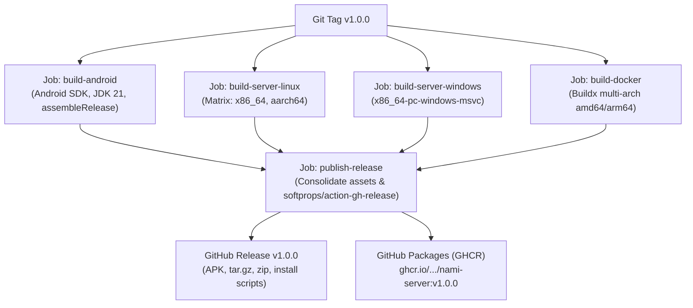

# 📋 План публикации релиза Nami (Unified Release Plan)

В данном документе описан регламент подготовки, проверки и автоматической публикации единого релиза музыкальной экосистемы **Nami** (Android-клиент + self-hosted сервер на Rust).

---

## 🎯 Цели релиза

Публикация единого тега (например, `v1.0.0`) в репозитории [MozzarellaCheesee/Nami](https://github.com/MozzarellaCheesee/Nami), в рамках которого GitHub Actions автоматически собирает, тестирует и прикрепляет к GitHub Release полный комплект артефактов:

| Артефакт | Назначение | Формат / Платформа |
| :--- | :--- | :--- |
| **`app-release.apk`** | Android-клиент Nami | Android 8.0+ (ARM64, x86_64, armeabi-v7a) |
| **`nami-server-linux-x86_64.tar.gz`** | Сервер Nami для стандартных ПК и VPS | Linux x86_64 (glibc / Ubuntu / Debian / Arch / Fedora) |
| **`nami-server-linux-aarch64.tar.gz`** | Сервер Nami для одноплатников и ARM VPS | Linux aarch64 (Raspberry Pi 4/5, Orange Pi, Oracle ARM) |
| **`nami-server-windows-x86_64.zip`** | Сервер Nami для Windows | Windows 10/11, Windows Server (x64) |
| **Docker-образ `ghcr.io`** | Контейнер сервера с автозапуском | `ghcr.io/mozzarellacheesee/nami-server:latest`, `:v1.0.0` |
| **`install.sh`** | Скрипт мгновенной установки для Linux | POSIX/Bash (systemd, автоопределение архитектуры) |
| **`install.ps1`** | Скрипт мгновенной установки для Windows | PowerShell 5.1+ (Брандмауэр, автозапуск, ярлык) |

---

## 🧭 Пошаговый сценарий релиза

### Этап 1: Подготовка репозитория и секретов (Pre-Flight)

1. **GitHub Secrets**:
   В настройках репозитория (`Settings → Secrets and variables → Actions`) должны быть заданы следующие секреты для подписи Android APK (при их отсутствии используется встроенный ключ проекта `secrets/nami.jks`):
   * `SIGNING_KEYSTORE_BASE64` — JKS-хранилище ключей в Base64.
   * `KEYSTORE_PASSWORD` — пароль к хранилищу.
   * `KEY_ALIAS` — алиас ключа подписи.
   * `KEY_PASSWORD` — пароль к ключу подписи.

2. **Разрешения GitHub Actions GITHUB_TOKEN**:
   В `Settings → Actions → General → Workflow permissions` выставить:
   * **Read and write permissions** (необходимо для создания GitHub Releases и пуша Docker-образов в GitHub Container Registry `ghcr.io`).

3. **Синхронизация версий**:
   * В `app/build.gradle.kts` проверить `versionName = "1.0.0"`.
   * В `server/Cargo.toml` проверить `version = "1.0.0"`.

---

### Этап 2: Локальная верификация сборки

Перед созданием публичного тега рекомендуется выполнить локальную контрольную сборку:

```powershell
# 1. Проверка компиляции сервера
cd C:\Nami\server
cargo test
cargo check --release

# 2. Проверка сборки Android-клиента
cd C:\Nami
$env:JAVA_HOME = "C:\Users\Mozzarella6\jdk-temurin-21\jdk-21.0.5+11"
.\gradlew.bat testReleaseUnitTest
.\gradlew.bat assembleRelease
```

---

### Этап 3: Создание и пуш git-тега

Публикация запускается обычным созданием подписанного или аннотированного git-тега:

```bash
git checkout main
git pull origin main

# Создание тега версии
git tag -a v1.0.0 -m "Release v1.0.0: Unified Android & Rust Server Release"

# Отправка тега на GitHub
git push origin v1.0.0
```

---

### Этап 4: Автоматический пайплайн CI/CD (GitHub Actions)

При пуше тега `v*` запускается рабочий процесс `.github/workflows/release.yml`, состоящий из 5 параллельных и зависимых задач:



---

## 🛠️ Полная спецификация GitHub Actions Workflow

Файл рабочего процесса сохранён в [`.github/workflows/release.yml`](.github/workflows/release.yml):

```yaml
name: Release

on:
  push:
    tags:
      - 'v*'

permissions:
  contents: write
  packages: write

jobs:
  # 1. Android APK
  build-android:
    name: Build Android APK
    runs-on: ubuntu-latest
    steps:
      - uses: actions/checkout@v4
        with:
          fetch-depth: 0

      - uses: actions/setup-java@v4
        with:
          distribution: 'temurin'
          java-version: '21'
          cache: 'gradle'

      - uses: android-actions/setup-android@v3

      - name: Prepare Signing Keystore
        shell: bash
        env:
          SIGNING_KEYSTORE_BASE64: ${{ secrets.SIGNING_KEYSTORE_BASE64 }}
          KEYSTORE_PASSWORD: ${{ secrets.KEYSTORE_PASSWORD }}
          KEY_ALIAS: ${{ secrets.KEY_ALIAS }}
          KEY_PASSWORD: ${{ secrets.KEY_PASSWORD }}
        run: |
          mkdir -p secrets
          if [ -n "$SIGNING_KEYSTORE_BASE64" ]; then
            echo "$SIGNING_KEYSTORE_BASE64" | base64 -d > secrets/nami.jks
            echo "nami.keystore.storePassword=$KEYSTORE_PASSWORD" >> local.properties
            echo "nami.keystore.keyAlias=$KEY_ALIAS" >> local.properties
            echo "nami.keystore.keyPassword=$KEY_PASSWORD" >> local.properties
          elif [ -f "secrets/nami.jks" ]; then
            echo "nami.keystore.storePassword=AstolfoServant13_" >> local.properties
            echo "nami.keystore.keyAlias=namimusic" >> local.properties
            echo "nami.keystore.keyPassword=AstolfoServant13_" >> local.properties
          fi

      - run: chmod +x gradlew
      - run: ./gradlew :app:assembleRelease --no-daemon --stacktrace

      - name: Locate and rename APK
        shell: bash
        run: |
          APK_PATH=$(find app/build/outputs/apk/release -name "*.apk" | head -n 1)
          cp "$APK_PATH" app-release.apk

      - uses: actions/upload-artifact@v4
        with:
          name: app-release
          path: app-release.apk

  # 2. Linux Server (x86_64, aarch64)
  build-server-linux:
    name: Build Linux Server (${{ matrix.target }})
    runs-on: ubuntu-latest
    strategy:
      matrix:
        include:
          - target: x86_64-unknown-linux-gnu
            archive_name: nami-server-linux-x86_64.tar.gz
            cross_pkg: gcc-x86-64-linux-gnu libc6-dev-amd64-cross
            linker: x86_64-linux-gnu-gcc
          - target: aarch64-unknown-linux-gnu
            archive_name: nami-server-linux-aarch64.tar.gz
            cross_pkg: gcc-aarch64-linux-gnu libc6-dev-arm64-cross
            linker: aarch64-linux-gnu-gcc
    steps:
      - uses: actions/checkout@v4
      - uses: dtolnay/rust-toolchain@stable
        with:
          targets: ${{ matrix.target }}
      - run: |
          sudo apt-get update
          sudo apt-get install -y --no-install-recommends ${{ matrix.cross_pkg }}
      - env:
          CARGO_TARGET_X86_64_UNKNOWN_LINUX_GNU_LINKER: ${{ matrix.linker }}
          CARGO_TARGET_AARCH64_UNKNOWN_LINUX_GNU_LINKER: ${{ matrix.linker }}
          CC_x86_64_unknown_linux_gnu: ${{ matrix.linker }}
          CC_aarch64_unknown_linux_gnu: ${{ matrix.linker }}
        run: cargo build --release --target ${{ matrix.target }} --manifest-path server/Cargo.toml
      - shell: bash
        run: |
          BIN="server/target/${{ matrix.target }}/release/nami-server"
          chmod +x "$BIN"
          tar -czf "${{ matrix.archive_name }}" -C "$(dirname "$BIN")" nami-server
      - uses: actions/upload-artifact@v4
        with:
          name: ${{ matrix.archive_name }}
          path: ${{ matrix.archive_name }}

  # 3. Windows Server (x86_64)
  build-server-windows:
    name: Build Windows Server (x86_64)
    runs-on: windows-latest
    steps:
      - uses: actions/checkout@v4
      - uses: dtolnay/rust-toolchain@stable
        with:
          targets: x86_64-pc-windows-msvc
      - run: cargo build --release --manifest-path server/Cargo.toml
      - shell: pwsh
        run: |
          $bin = "server\target\release\nami-server.exe"
          Compress-Archive -Path $bin -DestinationPath "nami-server-windows-x86_64.zip" -Force
      - uses: actions/upload-artifact@v4
        with:
          name: nami-server-windows-x86_64.zip
          path: nami-server-windows-x86_64.zip

  # 4. Multi-Arch Docker Image
  build-docker:
    name: Build & Push Docker Image
    runs-on: ubuntu-latest
    steps:
      - uses: actions/checkout@v4
      - uses: docker/setup-qemu-action@v3
      - uses: docker/setup-buildx-action@v3
      - uses: docker/login-action@v3
        with:
          registry: ghcr.io
          username: ${{ github.actor }}
          password: ${{ secrets.GITHUB_TOKEN }}
      - id: meta
        uses: docker/metadata-action@v5
        with:
          images: ghcr.io/${{ github.repository_owner }}/nami-server
          tags: |
            type=semver,pattern={{version}}
            type=raw,value=latest,enable=true
      - uses: docker/build-push-action@v5
        with:
          context: .
          file: server/Dockerfile
          platforms: linux/amd64,linux/arm64
          push: true
          tags: ${{ steps.meta.outputs.tags }}
          labels: ${{ steps.meta.outputs.labels }}

  # 5. Публикация единого GitHub Release
  publish-release:
    name: Publish GitHub Release
    needs: [build-android, build-server-linux, build-server-windows, build-docker]
    runs-on: ubuntu-latest
    steps:
      - uses: actions/checkout@v4
      - uses: actions/download-artifact@v4
        with:
          path: release-artifacts
      - shell: bash
        run: |
          mkdir -p dist
          find release-artifacts -type f -name "app-release.apk" -exec cp {} dist/ \;
          find release-artifacts -type f -name "nami-server-linux-x86_64.tar.gz" -exec cp {} dist/ \;
          find release-artifacts -type f -name "nami-server-linux-aarch64.tar.gz" -exec cp {} dist/ \;
          find release-artifacts -type f -name "nami-server-windows-x86_64.zip" -exec cp {} dist/ \;
          cp deploy/install.sh dist/install.sh
          cp deploy/install.ps1 dist/install.ps1
      - uses: softprops/action-gh-release@v2
        with:
          files: |
            dist/app-release.apk
            dist/nami-server-linux-x86_64.tar.gz
            dist/nami-server-linux-aarch64.tar.gz
            dist/nami-server-windows-x86_64.zip
            dist/install.sh
            dist/install.ps1
          draft: false
          prerelease: false
        env:
          GITHUB_TOKEN: ${{ secrets.GITHUB_TOKEN }}
```

---

## ✅ Чек-лист проверки перед релизом (Pre-Release Checklist)

### 1. Android-клиент
- [ ] **Воспроизведение и кодеки**:
  - [ ] FLAC 24-bit / 192 kHz играет корректно без артефактов и заиканий.
  - [ ] CUE-sheet распознаётся и корректно разбивает трек по таймкодам.
  - [ ] Opus, ALAC, WAV, MP3 и AAC файлы читаются и проигрываются.
- [ ] **Звуковой движок**:
  - [ ] ReplayGain BS.1770-4 выравнивает треки, пиковый лимитер предотвращает клиппинг.
  - [ ] Эквалайзер корректно применяет полосы и переключает пресеты.
  - [ ] Кроссфейд плавно микширует конец и начало треков.
  - [ ] Профили вывода (USB DAC, Bluetooth, проводные, динамик) сохраняются и переключаются при смене аудиовыхода.
- [ ] **Сеть и сопряжение**:
  - [ ] Камера сканирует QR-код со страницы `http://<ip>:4533/setup` и мгновенно подключает сервер.
  - [ ] Ручной ввод 8-значного кода сопряжения работает корректно.
  - [ ] Двусторонняя дельта-синхронизация плейлистов и рейтингов отрабатывает без ошибок.
  - [ ] Скробблинг на сервер отправляет статус прослушанных треков.
- [ ] **Jam («Джем»)**:
  - [ ] Создание комнаты с генерацией 6-значного кода.
  - [ ] Подключение второго устройства к Jam-комнате.
  - [ ] Синхронная смена треков и отображение плашки воспроизведения.
- [ ] **Интерфейс**:
  - [ ] Все тексты, подсказки и ошибки переведены на русский язык.
  - [ ] Тёмная и светлая темы отображаются корректно по дизайн-токенам `NamiDesignTokens`.

### 2. Nami Server (Rust)
- [ ] **Первичный запуск (Wizard)**:
  - [ ] При отсутствии `config.toml` сервер запускает мастер настройки на `http://0.0.0.0:4533/setup`.
  - [ ] Валидация путей папок с музыкой через `/setup/api/validate-path` корректно подсчитывает аудиофайлы.
  - [ ] Сохранение конфигурации создаёт `config.toml` и откладывает файл владельца `.nami-setup-owner`.
- [ ] **Сопряжение устройств**:
  - [ ] После перезапуска страница `http://<ip>:4533/setup` отображает SVG QR-код со схемой `nami://pair?v=1&host=...&port=4533&fp=sha256:...&code=...`.
  - [ ] 8-значный код одноразовый и истекает через 10 минут.
- [ ] **OpenSubsonic API**:
  - [ ] `GET /rest/ping.view` возвращает валидный XML/JSON ответ v1.16.1.
  - [ ] Сторонние клиенты (Symfonium, DSub, Feishin) успешно авторизуются и читают библиотеку.
- [ ] **Ресурсы и производительность**:
  - [ ] Потребление оперативной памяти не превышает 100-200 МБ в режиме сканирования.
  - [ ] Потоковое сканирование библиотеки на 10 000+ треков завершается без утечек памяти.
- [ ] **CLI утилиты**:
  - [ ] `nami status` показывает корректный статус службы и health check.
  - [ ] `nami logs` выводит последние строки лога.
  - [ ] `nami doctor` диагностирует открытость порта 4533, наличие ffmpeg и права доступа к БД.

### 3. Скрипты развёртывания
- [ ] **Linux (`deploy/install.sh`)**:
  - [ ] Запуск `bash deploy/install.sh` на чистой Ubuntu/Debian машине.
  - [ ] Корректное создание пользователя `nami`, папки `/var/lib/nami` и службы `nami.service`.
  - [ ] Проверка вывода подсказки по установке `ffmpeg`.
- [ ] **Windows (`deploy/install.ps1`)**:
  - [ ] Запуск в PowerShell от имени Администратора.
  - [ ] Проверка добавления правила Брандмауэра для порта 4533.
  - [ ] Создание ярлыка в меню «Пуск» и фоновой задачи автозапуска `NamiServer`.
  - [ ] Автоматическое открытие `http://localhost:4533/setup` в браузере.
