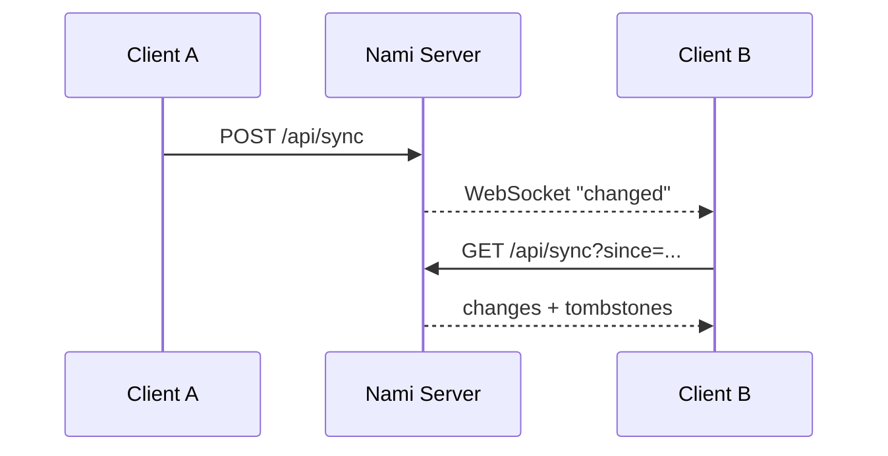

<p align="right">
  <strong>English</strong> · <a href="README.ru.md">Русский</a>
</p>

<p align="center">
  
</p>

<h1 align="center">Nami Server</h1>

<p align="center">
  <strong>Your library. Your server. Your stream.</strong>
</p>

<p align="center">
  Lightweight self-hosted music backend for Nami, written in Rust with Axum and SQLite.
</p>

<p align="center">
  
  
  
  
  
</p>

<p align="center">
  <a href="../README.md"></a>
  <a href="#quick-start"></a>
  <a href="#api-map"></a>
  <a href="#remote-access"></a>
</p>

---

> [!IMPORTANT]
> Nami Server is in active development (`0.1.0`). It is already a real, functional server, but its API and storage model should still be treated as pre-stable until the project declares otherwise.

## Overview

Nami Server extends the Android player with a private, self-hosted music backend. It indexes your files, streams originals byte-for-byte, can transcode when bandwidth is limited, synchronizes user state, pairs trusted devices and exposes a playback-oriented OpenSubsonic compatibility layer.

The implementation is intentionally built around a small footprint: **Rust + Axum + bundled SQLite**, with `ffmpeg` kept as an external tool for jobs where linking a full media stack into the server would be wasteful.

### Core capabilities

<table>
<tr>
<td width="50%" valign="top">

#### Library & streaming

- Filesystem scanning and metadata extraction.
- Original streaming with HTTP Range / `206 Partial Content`.
- Opus and AAC transcode profiles.
- Optional adaptive HLS variants.
- Artwork and waveform endpoints.
- Upload path with hash/metadata deduplication.

</td>
<td width="50%" valign="top">

#### Identity & sync

- QR / one-time-code device pairing.
- Bearer session/device tokens.
- Argon2id password hashes.
- Shared or separate user libraries.
- State synchronization with tombstones and LWW conflict handling.
- WebSocket change notifications.

</td>
</tr>
<tr>
<td width="50%" valign="top">

#### Social & compatibility

- Jam sessions over the existing WebSocket channel.
- Guest share links with expiration/play limits.
- “Now playing” visibility controls.
- Playback-focused OpenSubsonic subset.
- ListenBrainz scrobbling queue.

</td>
<td width="50%" valign="top">

#### Analysis & metadata

- Library-health diagnostics.
- MusicBrainz enrichment without rewriting source files.
- ReplayGain / EBU R128 analysis.
- BPM and musical-key estimation.
- Chromaprint support through `fpcalc`.
- 120-point RMS waveform generation.

</td>
</tr>
</table>

## Resource target

The server is designed with a low-power target in mind: roughly **1 CPU core, 512 MB RAM and a library on the order of 50,000 tracks**. That is an architectural budget, not a guaranteed benchmark under every workload: concurrent transcoding and full-library analysis can obviously consume more CPU.

<a id="quick-start"></a>
## Quick start

### Run from source

**Required**

- Rust toolchain / Cargo

**Optional but strongly recommended**

- `ffmpeg` — transcoding and server-side audio analysis
- `fpcalc` / Chromaprint — audio fingerprints

```bash
git clone https://github.com/MozzarellaCheesee/Nami.git
cd Nami/server
cargo run --release
```

If `config.toml` does not exist, the first launch exposes the setup wizard over HTTP:

```text
http://<server-address>:4533/setup
```

The wizard creates the initial configuration. After setup, the same `/setup` route becomes the device-pairing page.

### Manual configuration

```bash
cd server
cp config.example.toml config.toml
$EDITOR config.toml
cargo run --release
```

Every main configuration field can also be overridden with an environment variable, which is useful for Docker and service managers.

## Docker

### Local/LAN container

From the `server/` directory:

```bash
docker build -t nami-server .

docker run -d \
  --name nami-server \
  --restart unless-stopped \
  -p 4533:4533 \
  -v /path/to/music:/music:ro \
  -v nami-data:/data \
  nami-server
```

The image includes `ffmpeg`.

> [!NOTE]
> Filesystem watching depends on the mount implementation. Native Linux bind mounts generally support filesystem notifications; Docker Desktop and network filesystems may not. Manual `POST /api/scan` remains the fallback.

### Domain + Caddy + Let's Encrypt

The repository includes `docker-compose.yml` and `Caddyfile` for a reverse-proxy deployment:

```bash
cd server

NAMI_DOMAIN=music.example.com \
ACME_EMAIL=you@example.com \
NAMI_MUSIC=/path/to/music \
docker compose up -d
```

This mode expects DNS for the domain to point to the host and ports `80`/`443` to reach Caddy.

## First-run setup & pairing

### Initial setup

Without `config.toml`, `/setup` is the bootstrap wizard. It collects the server basics such as music directories, port/TLS settings and the initial owner credentials, writes the configuration and completes owner creation on the configured startup path.

### Device pairing

After the server is configured, `/setup` is used for pairing:

1. The server generates a QR code and one-time pairing code.
2. The client exchanges the code through `POST /api/auth/pair`.
3. The code is consumed and the device receives a persistent token.
4. The QR can include local addresses plus `external_url` when one is configured.
5. After the first trusted device exists, generating new pairing codes requires authorization from an already trusted session/device.

This avoids leaving an indefinitely open pairing endpoint on the local network.

## Configuration

The canonical starting point is [`config.example.toml`](config.example.toml).

| Setting | Environment | Purpose |
|---|---|---|
| `port` | `NAMI_PORT` | HTTP/HTTPS listen port; default `4533`. |
| `music_dirs` | `NAMI_MUSIC_DIRS` | One or more library roots. |
| `db_path` | `NAMI_DB_PATH` | SQLite database path. |
| `data_dir` | `NAMI_DATA_DIR` | Server data directory, including local TLS material. |
| `tls` | `NAMI_TLS` | Built-in self-signed TLS for direct/local use. |
| `watch` | `NAMI_WATCH` | Watch library roots for filesystem changes. |
| `transcode_cache_dir` | `NAMI_TRANSCODE_CACHE_DIR` | Cached transcodes. |
| `transcode_cache_mb` | `NAMI_TRANSCODE_CACHE_MB` | Transcode cache size ceiling. |
| `tombstone_ttl_days` | — | Retention of deleted sync records before physical cleanup. |
| `upload_dir` | `NAMI_UPLOAD_DIR` | Destination for tracks uploaded by clients. |
| `deepl_api_key` | `NAMI_DEEPL_API_KEY` | Optional DeepL key for lyric translation. |
| `lyrics_target_lang` | `NAMI_LYRICS_TARGET_LANG` | Default lyric translation language. |
| `external_url` | `NAMI_EXTERNAL_URL` | Public/private remote URL advertised to clients during pairing. |

> [!WARNING]
> Do not disable TLS on an internet-facing direct deployment. `NAMI_TLS=false` is appropriate when TLS is terminated by a trusted reverse proxy/tunnel or for strictly local development.

<a id="api-map"></a>
## API map

Authentication for normal Nami API routes uses:

```http
Authorization: Bearer <token>
```

WebSocket and the protected pairing page may use a token in the query string where browser limitations make a custom authorization header impractical.

### System & authentication

| Method | Endpoint | Purpose |
|---|---|---|
| `GET` | `/api/health` | Health, version, library size, TLS and tool availability. |
| `GET` | `/api/host-capabilities` | Measured CPU/RAM and capability thresholds. |
| `POST` | `/api/auth/pair` | One-time pairing code → device token. |
| `POST` | `/api/auth/register` | Create the initial owner (one-time path). |
| `POST` | `/api/auth/login` | Username/password → session token. |
| `POST` | `/api/auth/logout` | Revoke the current session. |
| `GET` | `/api/auth/devices` | List active devices. |
| `DELETE` | `/api/auth/devices/{id}` | Revoke a device token. |
| `GET/PATCH` | `/api/me` | Current user and visibility preferences. |
| `PUT` | `/api/me/password` | Change own password and revoke sessions. |

### Library & playback

| Method | Endpoint | Purpose |
|---|---|---|
| `GET` | `/api/tracks?limit&offset` | Paginated track list. |
| `GET` | `/api/tracks/{id}` | Track metadata. |
| `PATCH` | `/api/tracks/{id}` | Update server track metadata. |
| `PATCH` | `/api/albums` | Update title, year, or album artist across a visible album. |
| `PATCH` | `/api/artists` | Rename an artist across all visible tracks. |
| `POST` | `/api/tracks/match` | Match client tracks against server tracks. |
| `GET` | `/api/tracks/{id}/stream` | Original byte-for-byte stream with Range support. |
| `GET` | `/api/tracks/{id}/stream?profile=...` | Transcoded stream. |
| `GET` | `/api/tracks/{id}/hls/master.m3u8` | Adaptive HLS master playlist. |
| `GET` | `/api/tracks/{id}/artwork` | Track artwork. |
| `PUT` | `/api/tracks/{id}/artwork` | Replace server track artwork. |
| `GET` | `/api/tracks/{id}/waveform` | Generated waveform data. |
| `GET` | `/api/tracks/{id}/radio?limit=` | Track-based similarity radio. |
| `GET` | `/api/transcode/profiles` | Available transcode profiles. |
| `POST` | `/api/scan` | Rescan library. |
| `POST` | `/api/tracks/upload?filename=` | Upload and deduplicate a track. |

### State, users & collaboration

| Method | Endpoint | Purpose |
|---|---|---|
| `GET/POST` | `/api/sync` | Pull/push synchronized state. |
| `GET/POST` | `/api/position` | High-frequency playback position channel. |
| `GET` | `/api/ws` | Change notifications and Jam events. |
| `GET/POST` | `/api/users` | Owner user management. |
| `DELETE` | `/api/users/{id}` | Remove a user and associated state. |
| `PUT` | `/api/users/{id}/password` | Owner password reset for a user. |
| `GET/PUT` | `/api/users/{id}/folders` | Shared-library folder visibility. |
| `POST` | `/api/invites` | Create an invite. |
| `POST` | `/api/invites/{token}/accept` | Accept an invite. |
| `GET/PUT` | `/api/library-mode` | Switch shared/separate library mode. |
| `GET` | `/api/now-playing` | Visible current listening activity. |
| `GET` | `/api/jam/history?limit=` | Completed Jam session history. |
| `POST` | `/api/share` | Create an expiring guest share. |
| `DELETE` | `/api/share/{token}` | Revoke a guest share. |

### Lyrics, analysis & integrations

| Method | Endpoint | Purpose |
|---|---|---|
| `GET` | `/api/tracks/{id}/lyrics` | Cached/fetched lyrics and optional translation. |
| `GET` | `/api/library/health` | Missing/broken/duplicate metadata diagnostics. |
| `POST` | `/api/library/enrich?limit=` | MusicBrainz metadata enrichment. |
| `POST` | `/api/library/analyze?limit=` | Loudness, fingerprint, BPM, key and waveform analysis. |
| `PUT` | `/api/me/subsonic-password` | Set/revoke separate Subsonic password. |
| `PUT` | `/api/me/listenbrainz-token` | Set/revoke ListenBrainz token. |
| `POST` | `/api/scrobble` | Queue a completed listen. |
| `GET/POST` | `/rest/{action}` | OpenSubsonic-compatible endpoint family. |

## Streaming

### Original

Without a transcode profile, the server returns the source file **byte-for-byte** and supports HTTP Range requests for seeking.

### Transcoding

Available profiles currently include:

```text
opus96
opus128
opus192
aac128
aac192
```

The client chooses the profile. A typical policy is original on trusted Wi-Fi, a mid-rate Opus profile on mobile data and a lower profile while roaming.

Transcodes are cached on disk. Cache keys include track identity plus source file size/mtime and profile, so changing the source invalidates the old cached result naturally.

### HLS

`/api/tracks/{id}/hls/master.m3u8` exposes AAC variants intended for adaptive switching during playback. HLS is additive: explicit single-profile transcoding remains available and simpler when adaptation is unnecessary.

> [!NOTE]
> HLS cache eviction is not yet as mature as the normal transcode-cache eviction path.

## Synchronization model

Nami uses one state-sync channel for low-frequency entities such as playlists, ratings, tags, moments, loops, notes and listening history.



Conflicts are resolved with last-write-wins at field level, allowing different fields of the same record to be updated independently. Deleted records remain as tombstones for the configured TTL.

Playback position is intentionally separate because it updates far more frequently than playlists, ratings or notes.

## Multi-user libraries

Two library modes are supported:

- **`shared`** — one catalog, with optional per-user visible folder subtrees;
- **`separate`** — each user has a distinct `library_id` and library roots.

> [!CAUTION]
> Switching the library mode clears the indexed `tracks` table and requires a new scan. Treat it as an administrative migration, not a casual toggle.

Each user keeps separate synchronized state, playlists and playback position. “Now playing” visibility can be disabled by the user.

## Jam sessions

Jam uses the same `/api/ws` connection as normal server change events. The server coordinates timing and queue state, while each client streams the actual audio from the normal track endpoint.

Supported Jam actions include creating/joining/leaving a room, synchronized play events and shared queue additions.

Live Jam state is in memory and does **not** survive a server restart. Session history is persisted separately and remains queryable through `/api/jam/history`.

## Guest shares

`POST /api/share` creates a guest link that can be opened without a Nami account. A share can carry an expiration time and maximum play count, both checked on every request.

The guest page is intentionally small and uses regular browser audio playback.

## Lyrics

`GET /api/tracks/{id}/lyrics` can search LRCLIB and cache the result. Misses are cached too, avoiding repeated external lookups for tracks with no result.

Useful query parameters:

| Parameter | Meaning |
|---|---|
| `refresh=1` | Ignore cached result and search again. |
| `translate=1` | Add translation when a server-side DeepL key is configured. |
| `lang=EN` | Override the configured target language. |

Server-side furigana/romaji is intentionally **not** present yet. Keeping a full Japanese dictionary inside the lightweight server build would work against the project's footprint target; this is a candidate for an optional “thick” build later.

## Library health & enrichment

`GET /api/library/health` reports issues from the indexed catalog, including scan failures, disappeared files, missing artist/album/year data and likely duplicates.

`POST /api/library/enrich` fills missing metadata from MusicBrainz in controlled batches. It does **not** rewrite the user's source audio files and does not overwrite already-populated fields.

## Audio analysis

`POST /api/library/analyze` runs expensive analysis in explicit batches instead of blocking the library scanner.

Current analysis work includes:

- ReplayGain track gain and peak;
- integrated EBU R128 loudness;
- Chromaprint fingerprint when `fpcalc` is available;
- BPM estimate;
- musical key estimate;
- normalized 120-column RMS waveform.

BPM/key detection is an estimate, not a replacement for specialist DJ analysis software; tempo/key changes inside a track are a known limitation.

## OpenSubsonic compatibility

Nami exposes a **playback-oriented subset**, not the entire protocol surface.

Implemented areas include discovery/index browsing, artists/albums/songs, search, playlists for reading, streaming/download, cover art, starring/rating and scrobbling.

Unsupported operations return an explicit unsupported response instead of pretending success.

### Why there is a separate Subsonic password

Subsonic authentication requires data derived from the user's password in a way that cannot be produced from an Argon2id hash. Nami therefore keeps the main account password one-way hashed and allows the user to set a **separate Subsonic password** only for `/rest/` compatibility.

Until that separate password is explicitly set, Subsonic access for the user remains disabled.

## Scrobbling

Nami queues completed listens and can submit them to **ListenBrainz** using the token stored for the user. Failed submissions remain queued for retry up to the server's retry policy.

The threshold for “this track counts as listened” is a client decision; the server accepts the completed listen event.

Current server scrobbling integration is ListenBrainz-only. Last.fm and Maloja are not implemented yet.

<a id="remote-access"></a>
## Remote access

There are three documented remote-access models. Pick one; do not stack them without a reason.

### 1. Tailscale — simplest private option

Keep Nami on its local port and let Tailscale provide private reachability between your devices.

```bash
tailscale up

# Optional HTTPS endpoint through Tailscale Serve
tailscale serve --bg --https=443 http://localhost:4533
```

No router port-forwarding or public DNS is required.

### 2. Your own domain + Caddy

Use the included Compose/Caddy setup. Caddy terminates TLS and obtains/renews Let's Encrypt certificates automatically.

```bash
NAMI_DOMAIN=music.example.com \
ACME_EMAIL=you@example.com \
NAMI_MUSIC=/path/to/music \
docker compose up -d
```

### 3. Cloudflare Tunnel

A tunnel can publish the local server without directly opening the Nami port:

```bash
cloudflared tunnel create nami
cloudflared tunnel route dns nami music.example.com
cloudflared tunnel run --url http://localhost:4533 nami
```

When TLS is terminated by Tailscale Serve, Caddy or Cloudflare, running the Nami process itself with `NAMI_TLS=false` is expected.

## CLI commands

Nami Server can be completely managed directly from the command line without using a web browser:

### Mobile app pairing
```bash
# Generate a one-time 8-digit code and print an ASCII QR code in the terminal
nami pair

# Pair for a specific user
nami pair --user alice
```

### Automated domain and HTTPS setup
```bash
# Verify DNS, open ports 80/443, configure Caddy with Let's Encrypt and update config.toml
nami domain music.example.com
```

### User management (`nami users`)
```bash
nami users list                     # List registered users
nami users add <username>           # Add user (prompts for password or generates one)
nami users passwd <username>        # Change user password
nami users delete <username>        # Delete user
nami users invite --ttl-days 7      # Generate an invite link
```

### Paired devices (`nami devices`)
```bash
nami devices list                   # List paired devices
nami devices revoke <device_id>     # Revoke device pairing
```

### Library management (`nami library`)
```bash
nami library health                 # Library health audit (broken files, duplicates, missing tags)
nami library scan                   # Trigger library scan
nami library dirs                   # List configured music directories
nami library add-dir /path/to/music # Add music directory to configuration
```

### Configuration (`nami config`)
```bash
nami config show                    # Show active config.toml
nami config set <key> <value>       # Update setting in config.toml
```

### Server uninstallation (`nami uninstall`)
```bash
nami uninstall                      # Stop service, remove binary, interactively confirm DB removal
nami uninstall --purge              # Completely purge all data (/var/lib/nami) without prompt
```

## Security notes

- Human passwords are stored as Argon2id hashes.
- Device and session access uses revocable bearer tokens.
- Pairing codes are one-time credentials, not long-lived passwords.
- Pairing becomes protected after the first trusted device exists.
- Built-in local TLS can use a self-signed certificate whose fingerprint is carried through pairing.
- Source music directories should normally be mounted/read as **read-only** from the server process when possible.
- Guest links are capability URLs; give them expirations and revoke them when they are no longer needed.

## Known limitations

Current intentional or unfinished areas include:

- server-side furigana and romaji generation;
- a richer web client (the current one is intentionally minimal);
- full OpenSubsonic coverage — radio, podcasts and playlist editing through `/rest/` are not implemented;
- folder-permission management UI in the web owner panel;
- web UI for every password-management endpoint;
- live Jam recovery across server restarts;
- Last.fm/Maloja server-side scrobbling;
- full size-based eviction parity for the HLS cache.

Keeping these in the README is intentional: compatibility clients and operators should be able to distinguish “unsupported” from “broken”.

## Development

```bash
cd server

# Development build
cargo build

# Release build
cargo build --release

# Tests
cargo test
```

The server keeps blocking filesystem/media work out of Axum's async hot path where necessary. Expensive library analysis is batch-oriented by design.

## Project links

- **Main project:** [../README.md](../README.md)
- **Configuration template:** [config.example.toml](config.example.toml)
- **Dockerfile:** [Dockerfile](Dockerfile)
- **Domain deployment:** [docker-compose.yml](docker-compose.yml) + [Caddyfile](Caddyfile)
- **Issues:** https://github.com/MozzarellaCheesee/Nami/issues

---

<p align="center">
  <strong>Nami Server</strong><br/>
  Self-host your library without turning it into somebody else's cloud. 🌊
</p>
