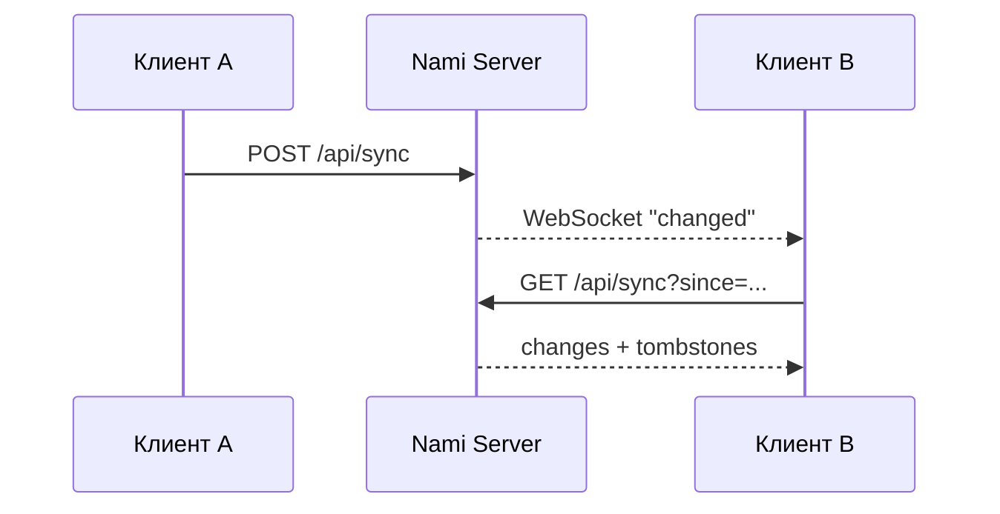

<p align="right">
  <a href="README.md">English</a> · <strong>Русский</strong>
</p>

<p align="center">
  
</p>

<h1 align="center">Nami Server</h1>

<p align="center">
  <strong>Ваша библиотека. Ваш сервер. Ваш стрим.</strong>
</p>

<p align="center">
  Лёгкий self-hosted музыкальный backend для Nami, написанный на Rust с Axum и SQLite.
</p>

<p align="center">
  
  
  
  
  
</p>

<p align="center">
  <a href="../README.ru.md"></a>
  <a href="#quick-start"></a>
  <a href="#api-map"></a>
  <a href="#remote-access"></a>
</p>

---

> [!IMPORTANT]
> Nami Server находится в активной разработке (`0.1.0`). Это уже реальный функциональный сервер, но его API и модель хранения следует считать pre-stable, пока проект явно не объявит обратное.

## Обзор

Nami Server расширяет Android-плеер приватным self-hosted музыкальным backend. Он индексирует ваши файлы, отдаёт оригиналы побайтово, умеет транскодировать при ограниченной пропускной способности, синхронизирует пользовательское состояние, сопрягает доверенные устройства и предоставляет ориентированный на воспроизведение слой совместимости с OpenSubsonic.

Реализация намеренно строится вокруг малого footprint: **Rust + Axum + bundled SQLite**, а `ffmpeg` остаётся внешним инструментом для задач, где встраивание полного media stack в сервер было бы избыточным.

### Основные возможности

<table>
<tr>
<td width="50%" valign="top">

#### Библиотека и стриминг

- Сканирование файловой системы и извлечение метаданных.
- Отдача оригинала с HTTP Range / `206 Partial Content`.
- Профили транскодинга Opus и AAC.
- Опциональные адаптивные HLS-варианты.
- Эндпоинты обложек и waveform.
- Загрузка файлов с дедупликацией по хешу/метаданным.

</td>
<td width="50%" valign="top">

#### Идентификация и синхронизация

- Сопряжение устройств по QR / одноразовому коду.
- Bearer-токены сессий и устройств.
- Хеширование паролей Argon2id.
- Общие или раздельные пользовательские библиотеки.
- Синхронизация состояния с tombstones и LWW-разрешением конфликтов.
- Уведомления об изменениях через WebSocket.

</td>
</tr>
<tr>
<td width="50%" valign="top">

#### Совместность и совместимость

- Jam-сессии через существующий WebSocket-канал.
- Гостевые ссылки с истечением срока/лимитом воспроизведений.
- Настройки видимости «Now playing».
- Поднабор OpenSubsonic для воспроизведения.
- Очередь скробблинга ListenBrainz.

</td>
<td width="50%" valign="top">

#### Анализ и метаданные

- Диагностика здоровья библиотеки.
- Обогащение MusicBrainz без изменения исходных файлов.
- Анализ ReplayGain / EBU R128.
- Оценка BPM и музыкальной тональности.
- Поддержка Chromaprint через `fpcalc`.
- Генерация RMS-waveform из 120 точек.

</td>
</tr>
</table>

## Целевой бюджет ресурсов

Сервер проектируется под маломощный класс устройств: примерно **1 CPU core, 512 MB RAM и библиотека порядка 50 000 треков**. Это архитектурный бюджет, а не гарантированный benchmark при любой нагрузке: одновременный транскодинг и анализ всей библиотеки, очевидно, могут потреблять больше CPU.

<a id="quick-start"></a>

## Быстрый старт

### Запуск из исходников

**Обязательно**

- Rust toolchain / Cargo

**Опционально, но настоятельно рекомендуется**

- `ffmpeg` — транскодинг и серверный анализ аудио
- `fpcalc` / Chromaprint — аудиофингерпринты

```bash
git clone https://github.com/MozzarellaCheesee/Nami.git
cd Nami/server
cargo run --release
```

Если `config.toml` отсутствует, первый запуск открывает мастер настройки по HTTP:

```text
http://<server-address>:4533/setup
```

Мастер создаёт начальную конфигурацию. После настройки тот же маршрут `/setup` становится страницей сопряжения устройств.

### Ручная настройка

```bash
cd server
cp config.example.toml config.toml
$EDITOR config.toml
cargo run --release
```

Все основные поля конфигурации также можно переопределить переменными окружения — это удобно для Docker и менеджеров сервисов.

## Docker

### Локальный/LAN контейнер

Из директории `server/`:

```bash
docker build -t nami-server .

docker run -d \
  --name nami-server \
  --restart unless-stopped \
  -p 4533:4533 \
  -v /path/to/music:/music:ro \
  -v nami-data:/data \
  nami-server
```

В image уже входит `ffmpeg`.

> [!NOTE]
> Наблюдение за файловой системой зависит от реализации mount. Нативные Linux bind mounts обычно поддерживают уведомления файловой системы; Docker Desktop и сетевые файловые системы — не всегда. Ручной `POST /api/scan` остаётся fallback-вариантом.

### Домен + Caddy + Let's Encrypt

В репозитории есть `docker-compose.yml` и `Caddyfile` для развёртывания с reverse proxy:

```bash
cd server

NAMI_DOMAIN=music.example.com \
ACME_EMAIL=you@example.com \
NAMI_MUSIC=/path/to/music \
docker compose up -d
```

В этом режиме DNS домена должен указывать на хост, а порты `80`/`443` должны быть доступны Caddy.

## Первичная настройка и сопряжение

### Первичная настройка

Без `config.toml` маршрут `/setup` является bootstrap-мастером. Он собирает основные параметры сервера — музыкальные директории, порт/TLS и данные первого владельца — записывает конфигурацию и завершает создание владельца при следующем запуске по настроенному пути.

### Сопряжение устройства

После настройки сервера `/setup` используется для сопряжения:

1. Сервер генерирует QR-код и одноразовый код сопряжения.
2. Клиент обменивает код через `POST /api/auth/pair`.
3. Код погашается, а устройство получает постоянный токен.
4. QR может содержать локальные адреса и `external_url`, если он настроен.
5. После появления первого доверенного устройства создание новых кодов сопряжения требует авторизации уже доверенной сессии/устройства.

Так endpoint сопряжения не остаётся бесконечно открытым в локальной сети.

## Конфигурация

Каноническая стартовая точка — [`config.example.toml`](config.example.toml).

| Параметр | Переменная окружения | Назначение |
|---|---|---|
| `port` | `NAMI_PORT` | Порт HTTP/HTTPS; по умолчанию `4533`. |
| `music_dirs` | `NAMI_MUSIC_DIRS` | Один или несколько корней библиотеки. |
| `db_path` | `NAMI_DB_PATH` | Путь к базе SQLite. |
| `data_dir` | `NAMI_DATA_DIR` | Директория данных сервера, включая локальные TLS-материалы. |
| `tls` | `NAMI_TLS` | Встроенный self-signed TLS для прямого/локального использования. |
| `watch` | `NAMI_WATCH` | Следить за изменениями в корнях библиотеки. |
| `transcode_cache_dir` | `NAMI_TRANSCODE_CACHE_DIR` | Кеш транскодов. |
| `transcode_cache_mb` | `NAMI_TRANSCODE_CACHE_MB` | Максимальный размер кеша транскодов. |
| `tombstone_ttl_days` | — | Срок хранения удалённых sync-записей до физической очистки. |
| `upload_dir` | `NAMI_UPLOAD_DIR` | Каталог назначения для треков, загружаемых клиентами. |
| `deepl_api_key` | `NAMI_DEEPL_API_KEY` | Опциональный ключ DeepL для перевода лирики. |
| `lyrics_target_lang` | `NAMI_LYRICS_TARGET_LANG` | Язык перевода лирики по умолчанию. |
| `external_url` | `NAMI_EXTERNAL_URL` | Публичный/приватный внешний URL, передаваемый клиентам при сопряжении. |

> [!WARNING]
> Не отключайте TLS при прямом размещении сервера в интернете. `NAMI_TLS=false` уместен, когда TLS завершается доверенным reverse proxy/tunnel либо при строго локальной разработке.

<a id="api-map"></a>

## Карта API

Обычные маршруты Nami API используют:

```http
Authorization: Bearer <token>
```

WebSocket и защищённая страница сопряжения могут использовать токен в query string там, где ограничения браузера не позволяют удобно отправить пользовательский authorization header.

### Система и аутентификация

| Метод | Endpoint | Назначение |
|---|---|---|
| `GET` | `/api/health` | Здоровье, версия, размер библиотеки, TLS и наличие инструментов. |
| `GET` | `/api/host-capabilities` | Измеренные CPU/RAM и пороги возможностей. |
| `POST` | `/api/auth/pair` | Одноразовый код сопряжения → токен устройства. |
| `POST` | `/api/auth/register` | Создать первого владельца (одноразовый путь). |
| `POST` | `/api/auth/login` | Логин/пароль → токен сессии. |
| `POST` | `/api/auth/logout` | Отозвать текущую сессию. |
| `GET` | `/api/auth/devices` | Список активных устройств. |
| `DELETE` | `/api/auth/devices/{id}` | Отозвать токен устройства. |
| `GET/PATCH` | `/api/me` | Текущий пользователь и настройки видимости. |
| `PUT` | `/api/me/password` | Сменить свой пароль и отозвать сессии. |

### Библиотека и воспроизведение

| Метод | Endpoint | Назначение |
|---|---|---|
| `GET` | `/api/tracks?limit&offset` | Постраничный список треков. |
| `GET` | `/api/tracks/{id}` | Метаданные трека. |
| `PATCH` | `/api/tracks/{id}` | Изменить метаданные серверного трека. |
| `PATCH` | `/api/albums` | Массово изменить название, год или album artist видимого альбома. |
| `PATCH` | `/api/artists` | Переименовать исполнителя во всех видимых треках. |
| `POST` | `/api/tracks/match` | Сопоставить клиентские треки с серверными. |
| `GET` | `/api/tracks/{id}/stream` | Побайтовая отдача оригинала с Range. |
| `GET` | `/api/tracks/{id}/stream?profile=...` | Транскодированный поток. |
| `GET` | `/api/tracks/{id}/hls/master.m3u8` | Master playlist адаптивного HLS. |
| `GET` | `/api/tracks/{id}/artwork` | Обложка трека. |
| `PUT` | `/api/tracks/{id}/artwork` | Заменить обложку серверного трека. |
| `GET` | `/api/tracks/{id}/waveform` | Сгенерированные данные waveform. |
| `GET` | `/api/tracks/{id}/radio?limit=` | Радио похожих треков. |
| `GET` | `/api/transcode/profiles` | Доступные профили транскодинга. |
| `POST` | `/api/scan` | Пересканировать библиотеку. |
| `POST` | `/api/tracks/upload?filename=` | Загрузить и дедуплицировать трек. |

### Состояние, пользователи и совместная работа

| Метод | Endpoint | Назначение |
|---|---|---|
| `GET/POST` | `/api/sync` | Получить/отправить синхронизируемое состояние. |
| `GET/POST` | `/api/position` | Высокочастотный канал позиции воспроизведения. |
| `GET` | `/api/ws` | Уведомления об изменениях и Jam-события. |
| `GET/POST` | `/api/users` | Управление пользователями владельцем. |
| `DELETE` | `/api/users/{id}` | Удалить пользователя и связанное состояние. |
| `PUT` | `/api/users/{id}/password` | Сбросить пароль пользователя владельцем. |
| `GET/PUT` | `/api/users/{id}/folders` | Видимость папок общей библиотеки. |
| `POST` | `/api/invites` | Создать приглашение. |
| `POST` | `/api/invites/{token}/accept` | Принять приглашение. |
| `GET/PUT` | `/api/library-mode` | Переключить общий/раздельный режим библиотек. |
| `GET` | `/api/now-playing` | Видимая текущая активность прослушивания. |
| `GET` | `/api/jam/history?limit=` | История завершённых Jam-сессий. |
| `POST` | `/api/share` | Создать временную гостевую ссылку. |
| `DELETE` | `/api/share/{token}` | Отозвать гостевую ссылку. |

### Лирика, анализ и интеграции

| Метод | Endpoint | Назначение |
|---|---|---|
| `GET` | `/api/tracks/{id}/lyrics` | Закешированная/найденная лирика и опциональный перевод. |
| `GET` | `/api/library/health` | Диагностика отсутствующих/сломанных/дублирующихся метаданных. |
| `POST` | `/api/library/enrich?limit=` | Обогащение метаданных через MusicBrainz. |
| `POST` | `/api/library/analyze?limit=` | Анализ громкости, fingerprint, BPM, key и waveform. |
| `PUT` | `/api/me/subsonic-password` | Задать/отозвать отдельный Subsonic-пароль. |
| `PUT` | `/api/me/listenbrainz-token` | Задать/отозвать токен ListenBrainz. |
| `POST` | `/api/scrobble` | Поставить завершённое прослушивание в очередь. |
| `GET/POST` | `/rest/{action}` | Семейство OpenSubsonic-совместимых endpoints. |

## Стриминг

### Оригинал

Без профиля транскодинга сервер возвращает исходный файл **байт-в-байт** и поддерживает HTTP Range для перемотки.

### Транскодинг

Сейчас доступны профили:

```text
opus96
opus128
opus192
aac128
aac192
```

Профиль выбирает клиент. Типичная политика: оригинал в доверенной Wi-Fi сети, средний Opus в мобильной сети и более низкий профиль в роуминге.

Транскоды кешируются на диске. Ключ кеша включает идентичность трека, размер/mtime исходного файла и профиль, поэтому изменение исходника естественным образом инвалидирует старый кеш.

### HLS

`/api/tracks/{id}/hls/master.m3u8` предоставляет AAC-варианты для адаптивного переключения во время воспроизведения. HLS дополняет обычный транскодинг: явный single-profile поток остаётся доступным и проще, когда адаптация не нужна.

> [!NOTE]
> Очистка HLS-кеша пока не так зрелая, как обычная система вытеснения кеша транскодов.

## Модель синхронизации

Nami использует один канал state sync для низкочастотных сущностей: плейлистов, рейтингов, тегов, Moments, петель, заметок и истории прослушивания.



Конфликты разрешаются по last-write-wins на уровне отдельных полей, поэтому разные поля одной записи можно обновлять независимо. Удалённые записи сохраняются как tombstones в течение настроенного TTL.

Позиция воспроизведения вынесена отдельно, поскольку обновляется намного чаще плейлистов, рейтингов или заметок.

## Многопользовательские библиотеки

Поддерживаются два режима:

- **`shared`** — единый каталог с опционально ограниченными для каждого пользователя поддеревьями папок;
- **`separate`** — у каждого пользователя собственный `library_id` и корни библиотеки.

> [!CAUTION]
> Переключение режима библиотеки очищает индексированную таблицу `tracks` и требует нового сканирования. Относитесь к этому как к административной миграции, а не повседневному переключателю.

У каждого пользователя отдельное синхронизируемое состояние, плейлисты и позиция воспроизведения. Видимость «Now playing» пользователь может отключить.

## Jam-сессии

Jam использует то же соединение `/api/ws`, что и обычные события изменений сервера. Сервер координирует время и состояние очереди, а каждый клиент получает само аудио через обычный endpoint трека.

Поддерживаемые Jam-действия включают создание/вход/выход из комнаты, синхронизированные play-события и добавление элементов в общую очередь.

Текущее состояние Jam живёт в памяти и **не** переживает перезапуск сервера. История сессий сохраняется отдельно и доступна через `/api/jam/history`.

## Гостевые ссылки

`POST /api/share` создаёт гостевую ссылку, которую можно открыть без аккаунта Nami. У ссылки может быть срок действия и максимальное число воспроизведений; оба ограничения проверяются при каждом запросе.

Гостевая страница намеренно маленькая и использует обычное браузерное воспроизведение аудио.

## Лирика

`GET /api/tracks/{id}/lyrics` может искать текст в LRCLIB и кешировать результат. Отрицательные результаты также кешируются, чтобы не повторять внешние запросы для треков, где ничего не найдено.

Полезные query parameters:

| Параметр | Значение |
|---|---|
| `refresh=1` | Игнорировать кеш и выполнить поиск заново. |
| `translate=1` | Добавить перевод, если на сервере настроен ключ DeepL. |
| `lang=EN` | Переопределить настроенный целевой язык. |

Серверная генерация furigana/romaji намеренно **пока отсутствует**. Полный японский словарь внутри лёгкой server-сборки противоречил бы целевому footprint; в будущем это может стать опциональной «толстой» сборкой.

## Здоровье библиотеки и обогащение

`GET /api/library/health` сообщает о проблемах индексированного каталога: ошибках сканирования, исчезнувших файлах, отсутствии artist/album/year и вероятных дубликатах.

`POST /api/library/enrich` заполняет отсутствующие метаданные через MusicBrainz контролируемыми пакетами. Он **не** переписывает исходные аудиофайлы пользователя и не заменяет уже заполненные поля.

## Анализ аудио

`POST /api/library/analyze` запускает тяжёлый анализ явными пакетами, не блокируя scanner библиотеки.

Текущий анализ включает:

- ReplayGain track gain и peak;
- integrated EBU R128 loudness;
- Chromaprint fingerprint при наличии `fpcalc`;
- оценку BPM;
- оценку музыкальной тональности;
- нормализованный RMS-waveform из 120 колонок.

Определение BPM/key является оценочным и не заменяет специализированные DJ-анализаторы; изменения темпа/тональности внутри трека — известное ограничение.

## Совместимость с OpenSubsonic

Nami предоставляет **ориентированный на воспроизведение поднабор**, а не весь протокол.

Реализованы discovery/index browsing, artists/albums/songs, поиск, чтение плейлистов, streaming/download, cover art, starring/rating и scrobbling.

Неподдерживаемые операции возвращают явный ответ unsupported вместо имитации успеха.

### Почему используется отдельный Subsonic-пароль

Subsonic-аутентификация требует данных, производных от пользовательского пароля, которые невозможно восстановить из Argon2id-хеша. Поэтому Nami хранит основной пароль аккаунта односторонне хешированным и позволяет задать **отдельный Subsonic-пароль** только для совместимости `/rest/`.

Пока отдельный пароль явно не задан, Subsonic-доступ пользователя остаётся выключенным.

## Скробблинг

Nami ставит завершённые прослушивания в очередь и может отправлять их в **ListenBrainz** с использованием сохранённого у пользователя токена. Неудачные отправки остаются в очереди и повторяются согласно retry-policy сервера.

Порог «трек считается прослушанным» решает клиент; сервер принимает уже завершённое событие прослушивания.

Текущая серверная интеграция скробблинга поддерживает только ListenBrainz. Last.fm и Maloja пока не реализованы.

<a id="remote-access"></a>

## Внешний доступ

Документированы три модели внешнего доступа. Выберите одну; не накладывайте их друг на друга без причины.

### 1. Tailscale — самый простой приватный вариант

Оставьте Nami на локальном порту, а приватную доступность между устройствами обеспечьте через Tailscale.

```bash
tailscale up

# Опциональный HTTPS endpoint через Tailscale Serve
tailscale serve --bg --https=443 http://localhost:4533
```

Проброс портов роутера и публичный DNS не требуются.

### 2. Собственный домен + Caddy

Используйте включённую Compose/Caddy-конфигурацию. Caddy завершает TLS и автоматически получает/обновляет сертификаты Let's Encrypt.

```bash
NAMI_DOMAIN=music.example.com \
ACME_EMAIL=you@example.com \
NAMI_MUSIC=/path/to/music \
docker compose up -d
```

### 3. Cloudflare Tunnel

Tunnel может опубликовать локальный сервер без прямого открытия порта Nami:

```bash
cloudflared tunnel create nami
cloudflared tunnel route dns nami music.example.com
cloudflared tunnel run --url http://localhost:4533 nami
```

Когда TLS завершается Tailscale Serve, Caddy или Cloudflare, ожидается запуск самого Nami с `NAMI_TLS=false`.

## Консольные команды управления (CLI)

Сервер Nami можно полностью администрировать прямо из терминала без необходимости открывать браузер:

### Сопряжение с мобильным приложением
```bash
# Генерация одноразового 8-значного кода и вывод ASCII QR-кода прямо в терминал
nami pair

# Сопряжение для конкретного пользователя (вместо владельца)
nami pair --user alice
```

### Автоматическая настройка домена и HTTPS
```bash
# Проверяет DNS, открывает порты 80/443, ставит Caddy с автовыпуском Let's Encrypt и настраивает config.toml
nami domain music.example.com
```

### Управление пользователями (`nami users`)
```bash
nami users list                     # Список зарегистрированных пользователей
nami users add <username>           # Добавить пользователя (запросит пароль или сгенерирует)
nami users passwd <username>        # Сменить пароль пользователя
nami users delete <username>        # Удалить пользователя
nami users invite --ttl-days 7      # Создать временную пригласительную ссылку
```

### Управление сопряжёнными устройствами (`nami devices`)
```bash
nami devices list                   # Список сопряжённых смартфонов и клиентов
nami devices revoke <device_id>     # Отозвать доступ устройства
```

### Управление библиотекой (`nami library`)
```bash
nami library health                 # Проверка здоровья библиотеки (битые файлы, дубликаты, треки без тегов)
nami library scan                   # Запуск фонового сканирования медиафайлов
nami library dirs                   # Список добавленных папок с музыкой
nami library add-dir /path/to/music # Добавить новую музыкальную директорию
```

### Просмотр и редактирование конфигурации (`nami config`)
```bash
nami config show                    # Показать текущую конфигурацию config.toml
nami config set <key> <value>       # Изменить значение параметра в config.toml
```

### Удаление сервера (`nami uninstall`)
```bash
nami uninstall                      # Останавливает службу, удаляет бинарник, интерактивно спрашивает про БД
nami uninstall --purge              # Полное удаление всех данных (/var/lib/nami) без подтверждения
```

## Заметки по безопасности

- Пароли людей хранятся как Argon2id-хеши.
- Доступ устройств и сессий использует отзывные bearer tokens.
- Коды сопряжения — одноразовые credentials, а не долгоживущие пароли.
- После появления первого доверенного устройства сопряжение становится защищённым.
- Встроенный локальный TLS может использовать self-signed сертификат, fingerprint которого передаётся при сопряжении.
- Исходные музыкальные директории по возможности следует монтировать/читать серверным процессом **только для чтения**.
- Гостевые ссылки — capability URLs; задавайте им срок действия и отзывайте, когда они больше не нужны.

## Известные ограничения

Текущие намеренные или незавершённые области:

- серверная генерация furigana и romaji;
- более богатый веб-клиент (текущий намеренно минимален);
- полное покрытие OpenSubsonic — radio, podcasts и редактирование плейлистов через `/rest/` не реализованы;
- UI управления доступом к папкам в web owner panel;
- web UI для каждого endpoint управления паролями;
- восстановление live Jam после перезапуска сервера;
- серверный скробблинг Last.fm/Maloja;
- полное выравнивание HLS-кеша с обычным size-based eviction.

Этот список намеренно остаётся в README: клиенты совместимости и операторы должны отличать «не поддерживается» от «сломано».

## Разработка

```bash
cd server

# Development-сборка
cargo build

# Release-сборка
cargo build --release

# Тесты
cargo test
```

Сервер по необходимости выносит блокирующую работу с файлами/media из горячего async-пути Axum. Тяжёлый анализ библиотеки по дизайну выполняется пакетами.

## Ссылки проекта

- **Главный проект:** [../README.ru.md](../README.ru.md)
- **Шаблон конфигурации:** [config.example.toml](config.example.toml)
- **Dockerfile:** [Dockerfile](Dockerfile)
- **Развёртывание с доменом:** [docker-compose.yml](docker-compose.yml) + [Caddyfile](Caddyfile)
- **Issues:** https://github.com/MozzarellaCheesee/Nami/issues

---

<p align="center">
  <strong>Nami Server</strong><br/>
  Self-host вашей библиотеки без превращения её в чужое облако. 🌊
</p>
